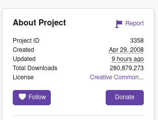

= Wadman: World of Warcraft addon manager

*Wadman* is a simple command-line tool to manage World of Warcraft addons.
It currently supports addons obtained from
https://www.curseforge.com/wow/addons[CurseForge] and
https://wowinterface.com/addons.php[WoW Interface]. It should work on any
platform that WoW can run on (and more besides), and has no dependencies.

== Installation

Currently, wadman has no published releases, but you can build and install
it from source. To do this you will need to first
https://golang.org/doc/install[download and install Go], then installing
wadman is simply a case of running:

[source,shell script]
----
go install ./cmd/wadman
----

You will then be able to run `wadman` from the command-line.

If you don't wish to install wadman you can also just run commands directly
from the source folder, e.g.:

[source,shell script]
----
go run ./cmd/wadman update --verbose
----

== Initial configuration

Wadman will attempt to autodetect your WoW install. Simply run `wadman update`
and it will report the detected directory. If this isn't correct, or it failed
to detect your install entirely, you can edit the JSON config file (located in
`%APPDATA%\wadman\config.json` on Windows or `~/.config/wadman/config.json` on
Linux). NB: As this is a JSON key you would need to escape back slashes, so
the config will look like this:

[source,json]
----
{
  "install_path": "C:\\Program Files (x86)\\World of Warcraft\\_retail_"
}
----

== Basic usage

=== Add new addons

The `wadman add` subcommand will download and install the specified addons,
and register them in wadman's config file to ensure they are kept up-to-date
in the future.

You can install multiple addons in one go, and use addons from multiple
different sources, for example:

[source,shell script]
----
wadman add curse:3358 wowi:15749
----

==== CurseForge addons _[curse:id]_

CurseForge addons are added using their project IDs. The CurseForge website
shows project IDs in the sidebar for each project. For example looking at
https://www.curseforge.com/wow/addons/deadly-boss-mods[Deadly Boss Mods]
the sidebar shows the project ID is `3358`:

So you can install this mod using the command:

[source,shell script]
----
wadman add curse:3358
----

==== WoW Interface addons _[wowi:id]_

WoW Interface addons are specified using their project IDs. The WoW Interface
website doesn't display this directly, but you can see it in the address
when viewing an addon.

For example the https://wowinterface.com/downloads/info15749-ThreatPlates.html[Threat Plates]
addon has the following address:

    https://wowinterface.com/downloads/info15749-ThreatPlates.html
                                           ^^^^^

So its project ID is 15749. You can install this mod using the command:

[source,shell script]
----
wadman add wowi:3358
----

=== Updating addons

Automatically updating all of your addons is as simple as running:

[source,shell script]
----
wadman update
----

If you wish to only update certain addons you can specify their IDs:

[source,shell script]
----
wadman update curse:3358 wowi:15749
----

If something has gone terribly wrong and you want to force the addon
to be re-installed regardless of what wadman thinks, you can use the
`--force` flag:

[source,shell script]
----
wadman update --force curse:3358 wowi:15749
----

=== Removing addons

Addons are removed using the `remove` subcommand which takes a list of
IDs in exactly the same way as the `add` command:

[source,shell script]
----
wadman remove curse:3358 wowi:15749
----

Wadman will remove the addons from its configuration and delete all of
their associated folders in the WOW addon directory. (Settings for mods
are stored in a different location and wadman doesn't touch these, so
you can safely remove addons and reinstall them later without losing
all of your configuration.)

=== Listing addons

Finally, you can list addons that wadman thinks are installed:

[source,shell script]
----
wadman list
----
